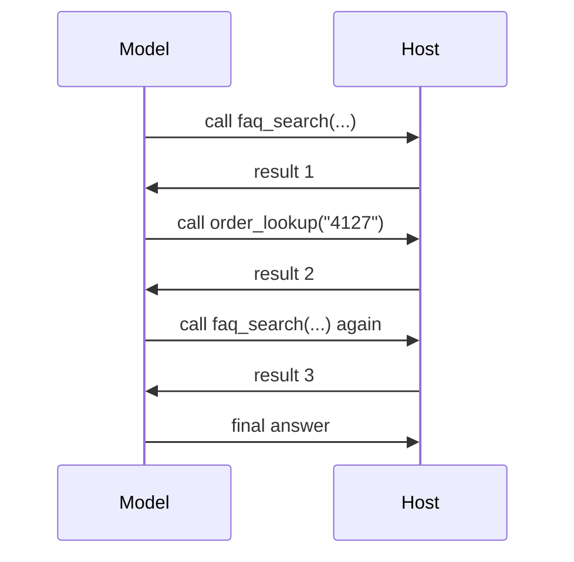

Order #4127 is two weeks late, its owner is furious, and your front desk just wrote them a sympathy card. The model composed a lovely paragraph about "understanding how frustrating delays can be" while the actual answer sat in your orders table, unreachable, because nothing you've built can *look anything up*.

The model has no hands. Let's fix that, and then immediately get nervous about having fixed it.

## Tools: buttons with labels

A tool is a plain Rust function the model may ask to run. Note the phrasing: *ask*. The model never executes your code; it requests a tool by name, DSRs runs the body, and the result goes back into the conversation.

Front Desk needs two:

```rust
use dspy_rs::tool;

/// Search the Sourdough FAQ. Returns the top matching entries.
#[tool(caps("kb:read"))]
fn faq_search(query: String) -> String {
    search_embedded_faq(&query) // a 20-line keyword match over faq.json
}

/// Look up an order by its number. Returns status, carrier, and ETA.
#[tool(caps("orders:read"))]
async fn order_lookup(order_id: String) -> Result<String, String> {
    orders_table()
        .get(&order_id)
        .map(|o| o.to_string())
        .ok_or_else(|| format!("no order with id {order_id}"))
}
```

Two design details are carrying weight here. The doc comment is what the model reads when deciding whether to press this button, so write it like a label on the button: what pressing it does, nothing else. And that `caps("...")` argument is the tool *declaring what it needs to touch*. `order_lookup` reads customer order data and says so in its type-adjacent metadata. Hold that thought; it becomes the whole next chapter.

Tools stay ordinary functions. `faq_search("jar".into())` works in a unit test. Async is fine, and fallible tools return `Result` with any error that prints nicely; the error text goes back to the model, which gets to read its mistake and try again.

## The agent: a loop with a leash

A step calls the model once. An **agent** is a step that runs a loop: the model reads the ticket, decides whether it needs a tool, calls it, reads the result, thinks again. Declared like every step you've written, bodyless, plus a tool list and a leash:

```rust
use dspy_rs::agent;

/// Research this ticket: find the relevant FAQ entry and, if an order is
/// referenced, its current status. Report only facts you actually found.
#[agent(tools(faq_search, order_lookup), max_turns = 6)]
fn research(ticket: String) -> String;
```

`max_turns = 6` is not a nicety. An unbounded model-with-tools is an unbounded bill. Every loop in a DSRs program carries an explicit bound, and when you need finer control there's `budget(tokens = ..., calls = ..., on_exhausted = finalize)`, where `finalize` means "out of budget: ask for a final answer instead of failing." You can even make stopping explicit with a `stop_tools(...)` submission tool, whose arguments *become* the step's output. Leashes, everywhere, by construction.

Wire it into the module between scrub and draft, and grant what the tools declared:

```rust
#[module(caps("kb:read", "orders:read"))]
async fn frontdesk(ticket: String) -> Result<DeskOut, dspy_rs::ir::RunError> {
    let clean: String = { /* the scrub, as before */ };
    let facts = research(clean.clone()).await?;
    let drafter = draft(clean.clone(), facts.research.clone()).await?;
    Ok(DeskOut { summary: facts.research, reply: drafter.draft })
}
```

Run the angry ticket (the runnable version of this milestone, `examples/23-frontdesk-agent.rs`, keeps the drafter on the `default` model, so the plain call needs no handle binding):

```text
$ cargo run
reply: Hi! Good news first: order #4127 shipped yesterday via UPS and is
due Thursday. The ceramic jars ran a two-week backorder, which is why...
```

The model decided, on its own, to call `order_lookup("4127")`, read the result, and build the reply on facts. You didn't script that sequence. You gave it hands and a leash.

(Struct-lane readers: the same power exists there as `ReAct<S>`, a drop-in strategy like `ChainOfThought` that runs the think/act/observe loop over any signature. Same idea, different lane; details in the [Modules reference](/docs/reference/modules).)

## The radio problem

Now watch your agent work on a hard ticket, and count the round trips.

Model asks for `faq_search("starter died after update")`. Full model turn. Result comes back. Model reads it, asks for `order_lookup("4127")`. Another full turn. Result. Model wants the FAQ entry about refund policy too. Another turn. Each tool call is a complete round trip through the model, with the whole conversation re-read each time. It's a scout radioing base camp for one landmark at a time.



The fix is called **Code Mode**, and it changes the medium. Instead of many tools, the model gets exactly one: `run_js`. Your tools appear inside a JavaScript sandbox as callable APIs, and the model writes *one script* that does the whole errand:

```javascript
// what the model submits to run_js (illustrative)
const faq = await faq_search({ query: "starter data lost after update" });
const order = await order_lookup({ order_id: "4127" });
return { findings: { faq, order } };
```

One turn. The script calls both tools, joins the results, and comes home. Loops, conditionals, retries, all inside the sandbox at sandbox speed instead of at conversation speed. Six round trips collapse into one, and models turn out to be *better* at writing small programs than at emitting long chains of JSON tool calls; code is their native genre. Enabling it is one seam per lane (a `ToolSet::code_mode(...)` for module-lane agents, `RuntimeEnv::with_code_mode(...)` for served programs); the full wiring lives in the [Code Mode reference](/docs/reference/code-mode).

Even the errors are part of the design: when a script fails, the sandbox returns a structured, tagged error the model can read and *repair*. The scout doesn't just get a dead radio; it gets told which street was closed.

## Sleeping well?

Pause on what you just did, though. Read it back as a security disclosure:

*We gave a language model read access to the customer order database, a tool that can be called with any argument the model invents, and, in the last section, a JavaScript interpreter.*

Each step was reasonable. The sum is a thing that should not be able to run unsupervised until someone answers some questions. What stops a tool from reaching further than it claimed? What stops a sandboxed script, which arrives inside a *text file*, from touching the network? When your colleague's server loads `frontdesk.dsrs` next month, what exactly is it agreeing to?

You've already seen the shape of the answer twice without being told: the `caps("orders:read")` a tool declares, the `caps(...)` a module grants, that empty `caps []` printed on your hole in Chapter 6. It's a customs system, and it's time to walk through the border crossing properly.

<Card title="Chapter 9: Nothing To Declare?" icon="arrow-right" href="/docs/learn/nothing-to-declare" horizontal>
  In which every program fills out a customs form, and the empty room has no door to pick.
</Card>

---

**Skip the story:** the lookup pages for this chapter are [Add tools](/docs/guides/add-tools) (host tools, stop tools, sandboxed tools), [Modules](/docs/reference/modules) (ReAct), and [Code Mode](/docs/reference/code-mode) (the sandbox, `run_js`, error contracts).
