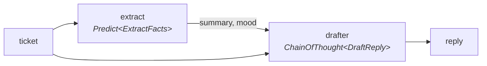

Every LM framework eventually faces the composition question: you have two steps, you want one pipeline, what's the syntax? And most frameworks answer with an invention. A graph builder. A pipe operator. A YAML file. A little language bolted onto your big language.

DSRs' answer is going to sound almost insultingly plain: you already have a language for putting two typed things together. A pipeline is a struct with two fields and a method.

## The front desk becomes a thing

```rust
use dspy_rs::{ChainOfThought, Module, Predict, Predicted, PredictError, WithReasoning};

#[derive(facet::Facet)]
#[facet(crate = facet)]
struct FrontDesk {
    extract: Predict<ExtractFacts>,
    drafter: ChainOfThought<DraftReply>,
}

impl Module for FrontDesk {
    type Input = ExtractFactsInput;
    type Output = WithReasoning<DraftReplyOutput>;

    async fn forward(
        &self,
        input: ExtractFactsInput,
    ) -> Result<Predicted<Self::Output>, PredictError> {
        let ticket = input.ticket.clone();
        let facts = self.extract.call(input).await?;

        self.drafter
            .call(DraftReplyInput {
                ticket,
                summary: facts.summary.clone(),
                mood: facts.mood.clone(),
            })
            .await
    }
}
```

That's the whole composition story. The `forward` body is ordinary Rust: call a step, use its output to build the next input, return the result. Want a branch? Write `if`. Want two extracts in parallel? `tokio::join!`. There's no framework vocabulary to learn because the framework's opinion is that Rust already had one.

```rust
let desk = FrontDesk {
    extract: Predict::new(),
    drafter: ChainOfThought::new(),
};
let out = desk.call(ExtractFactsInput { ticket: herman_ticket }).await?;
println!("{}", out.reply);
```

The shape of what runs:



Two details deserve a second look before we move on.

First, `call` versus `forward`: you *implement* `forward`, users *invoke* `call`. The split exists so tracing and hooks can wrap every module uniformly. It's also why your runs have been getting recorded since Chapter 1 without your participation.

Second, that `#[derive(facet::Facet)]` you were about to ask about. It makes your struct's fields *discoverable*: machinery can walk into `FrontDesk`, find the two predictors living inside, and reach their demos and instructions, without you registering anything. Discoverable to whom? Patience. Someone in [Act IV](/docs/learn/tracing-paper) is going to want a list of every knob in your pipeline, and this derive is how they'll get it.

## The quick lane

Sometimes a struct is more ceremony than the moment deserves. You're in a scratch file, testing whether the two-step idea works at all. For that there's `fx`, the functional lane: predictors as plain function calls, each with a *name*.

```rust
use dspy_rs::fx;

async fn front_desk(ticket: String) -> anyhow::Result<String> {
    let facts = fx::predict::<ExtractFacts>("extract", ExtractFactsInput {
        ticket: ticket.clone(),
    })
    .await?;

    let draft = fx::predict::<DraftReply>("drafter", DraftReplyInput {
        ticket,
        summary: facts.summary.clone(),
        mood: facts.mood.clone(),
    })
    .await?;

    Ok(draft.reply.clone())
}
```

No struct, no trait, no derive. Those string names aren't decoration, though: `"extract"` and `"drafter"` are stable addresses for each call site, which means their instructions and demos can be tuned from outside the function. Quick doesn't have to mean tuning-proof.

## Three lanes, one honest rule

So which one do you use? Here's the whole decision, and the reasoning under it.

Every way of writing a DSRs harness trades between two goods: how much arbitrary Rust you can write, and how much of your program the system can *see*. Structs maximize the first. You can put anything in a `forward` body, and precisely because you can, that body is a closed door: compiled code the system can run and watch, but never read. The fx lane cracks the door: the call sites have names, so the prompts are visible, but the glue between calls is still opaque Rust.

And there's a third lane, which this table has been quietly spoiling:

| | Structs | fx calls | `#[module]` |
|---|---|---|---|
| Run it | Yes | Yes | Yes |
| Trace its runs | Yes | Yes | Yes |
| Tune its prompts | Yes | Yes | Yes |
| Full control of the code | Yes | Some | Some |
| Print it as a `.dsrs` file | No | No | **Yes** |
| Serve it from a file | No | No | **Yes** |
| Restructure it with an optimizer | No | No | **Yes** |

The bottom three rows aren't features the first two lanes forgot to implement. They're physics. A server can't load your `forward` body from a file, because that body isn't in any file it can read. An optimizer can't rearrange steps it can't see. If the system can't hold your program as data, then running, watching, and prompt-tuning is the entire menu.

Not rivals, by the way. The lanes mix freely in one project: structs where you need total control, fx in a scratch script, and the third lane for anything you might want to inspect, ship, or improve.

## The silence

Which brings us to an experiment you should find mildly upsetting.

Your `FrontDesk` struct works. It runs, it traces, it can even be tuned. Now ask it the Prologue's question: *what do you look like?* Ask for the picture: two steps, extract feeding drafter, this signature here, that model there.

Silence. There is no method to call. The knowledge exists, completely, in exactly one place: your head, plus a `forward` body the system will never read. You've spent two acts building a beautiful territory, and you have drawn no map. Worse, you *can't* draw one from here; the door is closed by construction.

Unless a function could be read twice. Once by the compiler, to make it run. Once by something else, to make it *legible*.

<Card title="Chapter 6: One Parse, Two Projections" icon="arrow-right" href="/docs/learn/one-parse-two-projections" horizontal>
  The keystone: put one attribute on the function you already wrote, and a map falls out of the build.
</Card>

---

**Skip the story:** the lookup pages for this chapter are [Modules](/docs/reference/modules) (the trait, combinators, `forward_all`, strategy swapping) and [fx](/docs/reference/fx) (the functional lane's full API).
