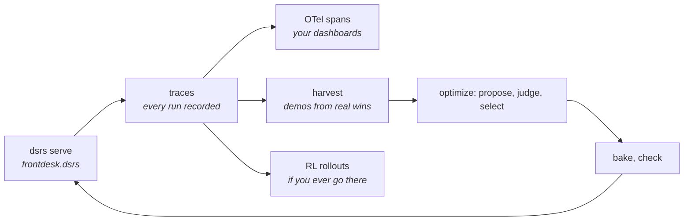

There's a line of code you wrote in Chapter 1, on faith, because a book told you to:

```rust
init_tracing()?;
```

Fifteen chapters later, every debt it created has been paid but one. It wired structured logging (respecting `RUST_LOG`, defaulting sensibly) and it's the reason your runs became traces, traces became replays, replays became cheap experiments, and cheap experiments became an optimization loop. The last unpaid debt is the production story: what happens to all this machinery when the desk is *live* and you're not watching?

## The desk on your dashboards

Your company already has observability: Grafana, Jaeger, Honeycomb, something with dashboards nobody looks at until Thursday's incident. Front Desk should appear there, not in some parallel LLM-specific tool you have to remember exists.

So traces project. The same expedition log you replayed in Chapter 10 exports as OpenTelemetry spans:

```rust
let otlp = trace.to_otlp_json("frontdesk", true); // service name; include_content: prompts and outputs ride along
```

Each run becomes a root `dsrs.rollout` span with child spans per step, carrying `gen_ai.*` semantic attributes, model, token counts, timing, and `dsrs.*` attributes like the step's *parameter path*. That last one matters more than it looks: when Thursday's incident is "replies got weird after Tuesday's deploy," the span doesn't just tell you latency spiked. It tells you *which named dial* the weird step reads from, and `/healthz` tells you which program hash is serving. Observability that speaks the same addresses your optimizer tunes.

## The log as a quarry

Now the bigger idea, the one the whole coda exists for. Ten thousand production traces are not exhaust. They're *ore*.

You mined traces once already: Chapter 12's BootstrapFewShot took twenty recorded runs and dug demos out of the ones your metric liked. Production makes that quarry effectively bottomless, and the machinery is the same: harvest the traces where the desk did well, promote the best real exchanges into demos, feed them to the next optimization round, evaluate against your judge, bake, check, serve. The optimizers reach for this automatically; your job is just to keep the ore flowing and the metric honest.

And for the day your improvement loop wants to go deeper than prompts, each trace also projects into reinforcement-learning form:

```rust
let rollout = trace.to_rl_rollout().expect("eval recorded"); // prompt/completion transitions plus the score
```

`RlRollout` is the standard shape weight-tuning pipelines eat: transitions with prompts, completions, and your metric's score attached. You may never use it. But notice *why* it's nearly free: because every run was already data, projecting it into a training row is a view, not a project.



Look at the shape of that diagram. The territory generates traffic, the traffic becomes a log, the log improves the map, and the improved map serves the territory. In Chapter 6 the map was generated from the territory *once, at build time, so it couldn't lie*. Now it's regenerated from the territory's own history, continuously, so it can't *stagnate* either. The flywheel is the thesis, spinning.

## The last door

One image to leave you with.

Everything that traveled through this book, the baked candidates, the served files, the diffs you reviewed, moved through one small text format. Small *on purpose*. A harness that fits on a page is a harness a language model can write. Not metaphorically: an LLM can emit a complete `.dsrs` program, and it will be checked by the same `dsrs check`, refused by the same customs when it over-reaches, granted the same empty sandbox room, served by the same host, and judged by the same metrics as anything you wrote by hand.

Sit with what that means. The artifact doesn't care whether its author was you, an optimizer, or a model, because every author faces identical borders. That's the endgame DSRs is built for: harnesses proposed by machines, verified by machinery, and approved by people, all in a format everyone at the table can read. The desk you built by hand this week is the training wheels for desks that will be *proposed to you* next year.

## From this side of the map

That's the book. A recap in one breath: you stopped writing prompts and started declaring contracts; contracts grew callers, callers grew pipelines, pipelines became maps; the maps got dragons, hands, and customs; the runs became logs, the logs became numbers, the numbers summoned optimizers; a model learned to judge, the winner learned to travel, and the traveler now feeds its own next version.

What's *not* in the book: the full grammar, every builder flag, every error variant. That's what the [Reference](/docs/reference/macros) tab is for, complete and unsentimental, and the [Guides](/docs/guides/write-steps) tab keeps the short recipes for when you know exactly what you came to do. The [examples index](/docs/guides/examples) maps every runnable program in the repo.

Go build a strange one. Bring your logs, they're worth more than you think. And if you find a better metaphor than the tracing paper, the [Discord](https://discord.com/invite/ZAEGgxjPUe) is where the map gets argued about.

The map is not the territory. Generate it from the territory anyway.
