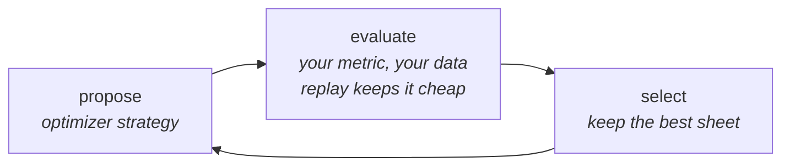

Cartographers have a rule so old it's practically an instinct: you don't sketch on the master map. When someone wants to try a new route, they lay **tracing paper** over the map and draw on *that*. Ten ideas, ten cheap translucent sheets. The original stays clean, every sheet is addressed to the exact grid squares it changes, and promoting a winner means copying one sheet down, deliberately, with a note about who drew it.

Hold that image. It is not a metaphor for what DSRs optimizers do. It is, almost embarrassingly, just a description of the API.

## The overlay: tracing paper as a type

Chapter 11 left you hand-executing an optimization loop. Before machines take it over, look at the primitive they'll use, because you can drive it by hand first.

Every dial in your program has a name and an address; that was Chapter 6's gift. `drafter.instruction`. `sum.demos`. Ask the map and it answers:

```rust
let program = frontdesk::program();
assert!(program.param_id("drafter.instruction").is_some());
```

A candidate change is an `Overlay`: a sheet laid over one specific program, carrying new values for named slots:

```rust
use dspy_rs::ir::{Instruction, Overlay};

let mut candidate = Overlay::new(program);
let slot = program.slot_of::<Instruction>("drafter.instruction").unwrap();
candidate.set_instruction(slot, "Reply in three short paragraphs. \
    Open by naming the customer's actual problem. Never promise a refund.");
```

Run anything under the sheet, and every step reads through it:

```rust
use dspy_rs::ir::with_ambient_overlay;
use std::sync::Arc;

let candidate = Arc::new(candidate);
let out = with_ambient_overlay(Arc::clone(&candidate), frontdesk(ticket)).await?;
```

Here's the part to internalize: **the program was never mutated.** Print `frontdesk::program().to_dsrs()` right now and your original instruction is still there. The overlay applied only inside that scope. Which means ten candidates are ten cheap sheets over one shared program, they can be *evaluated concurrently* without a single `&mut` anywhere, and a sheet physically cannot be applied to the wrong map: every overlay remembers the hash of its base program, and the runtime refuses a mismatch. Tuning results from version three can never silently contaminate version four.

Tracing paper, typed.

## Hiring the machine

Now re-read your Chapter 11 hand-loop with the pieces on the table. *Propose* a candidate: that's building an overlay. *Evaluate* it: that's Chapter 11's metric over Chapter 11's dataset, with Chapter 10's replay keeping the unchanged steps free. *Select*: compare numbers, keep the winner. The loop is fully mechanized except the proposing.

An **optimizer** is a candidate-proposing strategy plugged into that loop. `compile` is the whole ceremony:

```rust
use dspy_rs::{COPRO, Optimizer};

let copro = COPRO::builder().breadth(8).depth(3).build();
copro.compile::<Triage, _, _>(&mut desk, trainset, &TriageAccuracy).await?;
```

Same trainset. Same metric. You wrote no new concepts to reach this line; you assembled Act III.

DSRs ships a family of proposal strategies, and they're best understood as answers to one question: *where do better candidates come from?*

**COPRO** answers: from iteration. Generate a breadth of instruction variants, score them, refine the best, repeat to depth. Simple, fast, the obvious first hire.

**BootstrapFewShot** answers: from your own successes, and this is Chapter 10 paying off a second time. It runs the pipeline, keeps the traces where the metric scored well, and *mines those traces for demos*. The expedition log becomes teaching material: real inputs, real good outputs, promoted into few-shot examples. You hand-authored two demos in Chapter 3; Bootstrap manufactures them from evidence.

**MIPROv2** answers: from understanding. It has a model *read your program first*, then generate candidates informed by a library of prompting technique, and searches instruction-and-demo combinations jointly. Slower, stronger.

**SIMBA** answers: from introspection at scale. Mini-batches, and after each round the model reflects on what failed before proposing the next move. Strongest on pipelines with many interacting dials.

Different imaginations, one contract: they all propose overlays, they all defer to *your* metric, and none of them ever touches your code.



## The montage

You point COPRO at triage overnight, with a budget. The log reads like watching someone else do your job with infinite patience: candidates proposed, scored, discarded; a phrasing about refunds surviving three rounds; demo sets swapping in from bootstrapped traces.

Morning:

```text
triage accuracy: 71% -> 84%
best candidate: overlay 9f3a...c2 (instruction + 3 demos)
```

Thirteen points. And because the winner is *data*, you don't have to trust the number blind; you can read the improvement like a code review. Bake it (the full bake ceremony is [Chapter 14's](/docs/learn/the-map-leaves-home) business) and diff the sheets:

```diff
 sig Triage {
-  "Classify a support ticket for the Sourdough app."
+  "Classify a support ticket for the Sourdough app. A ticket about
+   charges or refunds is Billing even when it also describes a crash.
+   FeatureRequest requires an explicit ask, not a complaint."
   in  ticket: string
   out category: Category
 }
```

There it is, in the diff: the machine found your Chapter 3 confusion, the charged-twice-after-crash ticket, and wrote the tie-breaking rule you never quite articulated. The optimizer didn't just move a number. It left you a legible artifact explaining *what it learned*, in a text file, in review, like any other change.

## The ceiling

Time to say the quiet part. Every point of that 84% is measured by `TriageAccuracy`, and `TriageAccuracy` grades *the category*. The optimizer, obedient creature, optimized exactly what you measured.

Meanwhile the drafter, the step that writes sentences to frightened humans, sits outside the scoreboard entirely. Is the reply kind? Does it actually address the ticket instead of orbiting it? Does it read like Sourdough or like a form letter? Your metric has no opinion, so your optimizer has none either. `==` was a luxury of the enum; there is no `==` for warmth.

You need a judge that can read. It so happens you own several thousand dollars an hour of reading comprehension, priced by the token.

<Card title="Chapter 13: When the Judge Is a Model" icon="arrow-right" href="/docs/learn/when-the-judge-is-a-model" horizontal>
  In which a model grades the prose, the feedback becomes food, and candidates evolve along a frontier.
</Card>

---

**Skip the story:** the lookup pages for this chapter are [Optimizers](/docs/reference/optimizers) (all five, configs and reports), [Optimizer engine](/docs/reference/optimizer-engine) (overlays, budgets, caching, Pareto machinery), and the how-to recipes for [COPRO](/docs/optimizers/copro) and [MIPROv2](/docs/optimizers/miprov2).
