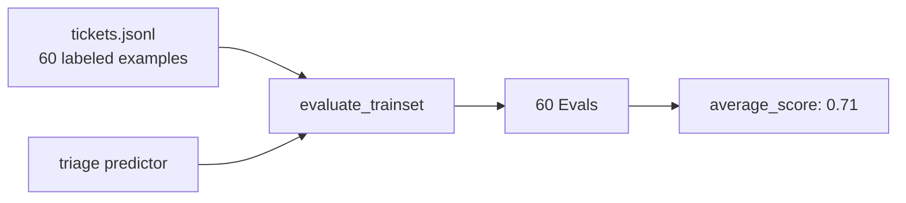

There's an old navigation joke: a traveler asks which road to take, and gets the only correct answer: *depends where you're going*. Act III ends with Front Desk learning where it's going.

Because look at yourself. Chapter 10 made experiments nearly free, and what did you do with the savings? Generated five instruction variants and read their replies squinting, at 6pm, deciding version C "feels warmer." You built a laboratory and staffed it with vibes.

To do better you need exactly two objects, and neither is exotic: a set of cases where you *know* the right answer, and a function that says how close you came. A dataset, and a metric. A destination, before you argue about routes.

## Sixty tickets, labeled

You're not starting from nothing. You have twenty recorded runs from Chapter 10, real tickets with known-correct categories you can label in one sitting, plus a support inbox generating more every day. An hour of honest labeling later, you have a file:

```json
{"ticket": "Charged twice after the update crashed mid-payment", "category": "Billing"}
{"ticket": "How do I export my feeding log as CSV?", "category": "HowTo"}
{"ticket": "PLEASE add a dark mode, my starter and I feed at 2am", "category": "FeatureRequest"}
```

Sixty lines. Loading it is one call, typed against the signature it will test:

```rust
use dspy_rs::{DataLoader, TypedLoadOptions};

let trainset = DataLoader::load_json::<Triage>(
    "data/tickets.jsonl",
    true,
    TypedLoadOptions::default(),
)?;
// Vec<Example<Triage>>
```

And there's `Example<S>` again, keeping the promise it made in Chapter 3: the same type that carried two demos into a predictor now carries sixty labeled cases into an evaluation. A demo and a test case were always the same thing, an input plus the output you'd accept, just pointed in different directions. CSV, Parquet, and Hugging Face datasets load through the same door when your labels live elsewhere.

## The metric: judgment, typed

Now the second object. What does "right" mean for triage? Mercifully crisp: the predicted category either matches the label or it doesn't.

```rust
use dspy_rs::{Eval, Example, Predict, Predicted, Trace, TypedMetric};

struct TriageAccuracy;

impl TypedMetric<Triage, Predict<Triage>> for TriageAccuracy {
    async fn evaluate(
        &self,
        example: &Example<Triage>,
        prediction: &Predicted<TriageOutput>,
        _trace: Option<&Trace>,
    ) -> anyhow::Result<Eval> {
        let hit = example.output.category == prediction.category;
        Ok(Eval::score(if hit { 1.0 } else { 0.0 }))
    }
}
```

(Give `Category` a `PartialEq` derive; enums earn their keep again.)

Notice two things about the shape of this trait, both of which are promissory notes. An `Eval` carries a score *and* an optional `feedback` string; you're not using feedback yet, but a metric that can *explain* a failure in words is worth vastly more than one that can only frown, and something in [Chapter 13](/docs/learn/when-the-judge-is-a-model) reads those words. And the third argument hands you the full trace of the run being scored, the Chapter 10 expedition log (wrapped in an `Option`; the evaluation loop always passes one), so a metric can judge not just the answer but *how the pipeline got there*. Ignore both today. They're loaded weapons on the wall.

## The number

```rust
use dspy_rs::{average_score, evaluate_trainset};

let evals = evaluate_trainset(&triage, &trainset, &TriageAccuracy).await?;
println!("triage accuracy: {:.0}%", average_score(&evals) * 100.0);
```

Sixty tickets fan out through the predictor concurrently (sixteen at a time by default), each answer meets the metric, and the scores come home:

```text
triage accuracy: 71%
```



Sit with 71% for a second, because your relationship with this pipeline just changed permanently. Yesterday, "the desk is pretty decent" was a mood. Today it's a *measurement* with a denominator: 43 of 60 tickets triaged correctly, and, more usefully, 17 specific failures you can go read. The next time you tweak an instruction, "is it better?" has a procedure instead of a squint: run the eval, compare two numbers. Version C doesn't get to feel warmer anymore. It gets to score 74 or it doesn't.

An honest caveat, so the number doesn't swindle you: 71% grades *triage*, the crisply-checkable step. Nothing here grades the replies, and reply quality is the thing customers actually experience. "Did the category match" and "was this a good answer to a frightened sourdough owner" are different kinds of question, and the second one has no `==` operator. Park that discomfort; it's Chapter 13's opening scene.

## The ceiling

So you go to work on 71%, and your workflow looks like this. Read some failures. Guess: maybe the instruction should mention that refund requests are Billing even when they describe a bug. Edit the instruction. Re-run the eval: 73%. Guess again: maybe a demo showing a mixed bug-billing ticket. Add it. Re-run. 72%, worse, revert. Try phrasing the mood definitions differently. 74%.

Recognize the loop? *Propose a change, evaluate it, keep it if it helps, repeat.* You are executing an optimization algorithm. By hand. At human speed. With human patience, which is to say, you'll quit after six iterations and call whatever you have "tuned."

Everything the loop needs is machine-legible now. The dials have names and addresses: you built that in Chapters 5 and 6, when every instruction and every demo set became data with a path. The judge is a function: you built that today. The runs are cheap: Chapter 10. The only remaining component executing at biological clock speed is *you, proposing candidates*.

That's not a calling. That's a job description for a machine.

<Card title="Chapter 12: Tracing Paper" icon="arrow-right" href="/docs/learn/tracing-paper" horizontal>
  Act IV opens: optimizers lay candidate edits over your program like tracing paper, and 71% starts to climb.
</Card>

---

**Skip the story:** the lookup pages for this chapter are [Evaluate](/docs/reference/evaluate) (`TypedMetric`, `Eval`, the run functions, feedback helpers) and [Data](/docs/reference/data) (every loader, options, error variants).
