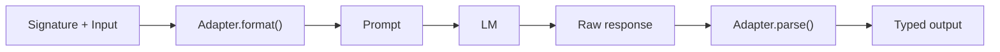

Three chapters of machinery you've never seen. Structs went in, typed answers came out, and somewhere in between, *something* wrote English to a model on your behalf.

This is the interlude where we open the hood. Once. Not because you'll need to do this often, but because trust in a layer you've never inspected isn't trust, it's hope. So: what did the model actually see?

The layer with the answers is called the **adapter**. It has exactly two jobs, and they're mirror images:



Format on the way out. Parse on the way back. And because the default adapter (`ChatAdapter`) is a thing you can call directly, you don't have to take anyone's word for what it writes:

```rust
use dspy_rs::ChatAdapter;

let adapter = ChatAdapter;
let system = adapter.format_system_message_typed::<Triage>()?;
println!("{system}");
```

## Reading the prompt your enum became

Here's what comes out for Chapter 1's humble `Triage`, lightly trimmed:

```text
Your input fields are:
1. `ticket` (string): The full text of the customer's ticket

Your output fields are:
1. `category` (Category)

All interactions will be structured in the following way:

[[ ## ticket ## ]]
ticket

[[ ## category ## ]]
Output field `category` should be of type: Category

Category
----
- Bug
- Billing
- HowTo
- FeatureRequest

[[ ## completed ## ]]

Respond with the corresponding output fields, starting with
`[[ ## category ## ]]`, and then ending with the marker for
`[[ ## completed ## ]]`.

In adhering to this structure, your objective is:
        Classify a support ticket for the Sourdough app.
```

Take a minute with this, because everything you declared in Act I is visible in it.

Your field docstring from Chapter 1 became line 1. Your enum became that `Category` block, four legal values, spelled out; this is why `kinda mad` was never going to parse. Those `[[ ## field ## ]]` fences are the **marker protocol**, a convention DSRs inherits from DSPy: the model may think in prose all it wants, but each output field lives between its markers, which is what makes the response mechanically recoverable without forbidding the model from being a language model.

And the punchline placement: your instruction, the docstring you wrote, arrives *last*, as "your objective." The structural scaffolding opens the prompt; your intent closes it, right where models pay the most attention. You spent three chapters designing types, and the adapter spent them compiling your types into all of this.

The nested stuff from Chapter 2 gets the same treatment at higher wattage: `OrderRef` renders as a JSON-shaped schema with its field docs inlined, `Option` marks the field as nullable, and type names get cleaned for model consumption (module paths stripped, `A | B` rendered as `A or B`).

## The way back: parsing what models actually write

Formatting is the easy direction. The return trip is where engineering lives, because here's a real model response on a bad day:

```text
[[ ## category ## ]]
Sure! Based on the ticket, this is clearly a bug:
```json
{"category": "Bug",}
```
[[ ## completed ## ]]
```

Preamble chatter. A markdown fence nobody asked for. A trailing comma that isn't legal JSON. Three felonies in four lines, and this parses *successfully* into `Category::Bug`.

The rescue squad is the coercion layer of DSRs' in-house type system, `typesys`: it extracts content from between the markers, digs structure out of fences and chatter, repairs near-miss JSON (missing quotes, trailing commas), and coerces near-miss types (`"42"` into `42`) against the schema your signature declared. It's deliberately charitable on structure and strict on meaning: mess gets cleaned, but a value that genuinely isn't a `Category` still fails, loudly, with every problem reported at once and the partial parse attached. That's the typed error from Chapter 1 keeping its promise.

Your Chapter 2 constraints run right after: `#[check]` verdicts are recorded into metadata, `#[assert]` violations turn the whole parse into an error. The contract gets enforced at the border, both directions.

## Closing the hood

Should you ever touch this layer again? Rarely. Two occasions: debugging a step whose output makes no sense (print the prompt, and the mystery usually dies on contact) and the `#[format]` / `#[render]` attributes when an input field needs custom rendering into the prompt. Otherwise the adapter's whole job is to be forgettable, and now it has earned the right honestly. You've seen the prompt. It's your types, compiled.

So: one call. Contract declared, baggage in the caller, wire format verified. By every measure of this act, a single model call is now a *solved problem*.

Look at your inbox again. Forty tickets this morning. Triage feeds drafting, drafting wants facts, half the flow should be one flow. Your inbox is not one call, and one call is all you know how to ship.

Act II is where the calls start holding hands.

<Card title="Chapter 5: Pipelines Are Just Structs" icon="arrow-right" href="/docs/learn/pipelines-are-just-structs" horizontal>
  In which composition turns out to be the composition you already know, and three lanes open on the same road.
</Card>

---

**Skip the story:** the lookup pages for this chapter are [Adapters](/docs/reference/adapters) (full prompt anatomy, rendering attributes, parse behavior) and [Signatures & types](/docs/reference/signatures-and-types).
