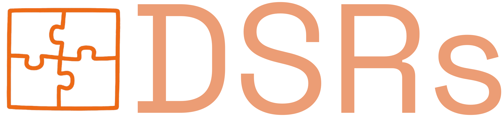

DSRs is a rewrite of the DSPy framework, built from the ground up in Rust for programming robust, LLM-powered applications. By leveraging Rust’s type system, memory safety, and concurrency, DSRs offers a more efficient and reliable foundation for language model workflows.

- **Not just a port:** DSRs reimagines DSPy’s abstractions with Rust’s strengths in mind.
- **Modern Rust API:** Take advantage of Rust’s ecosystem, async support, and strong typing.
- **Core features:** Includes signatures, modules, adapters, etc.
- **Easy to get started:** Install via Cargo, and follow the [Quickstart](docs/getting-started/quickstart) to build your first pipeline in minutes.

> _Inspired by the original [DSPy](https://github.com/stanfordnlp/dspy) framework, DSRs brings LLM application development to the Rust community._

## Setting up

Get your documentation site up and running in minutes.

<Card
  title="Start here"
  icon="rocket"
  href="docs/getting-started/quickstart"
  horizontal
>
  Get up and running with DSRs in under 5 minutes. Install, configure, and run your first pipeline.
</Card>

## Learn More

Understand in-depth about the building blocks of DSRs

<Columns cols={2}>
  <Card
    title="Data"
    icon="folder"
    href="/docs/data/examples"
  >
    Learn about the Data Currency of DSRs
  </Card>
  <Card
    title="Building Blocks"
    icon="puzzle"
    href="/docs/building-blocks/signature"
  >
    Learn about the concepts that make up the foundation of DSRs
  </Card>
</Columns>
