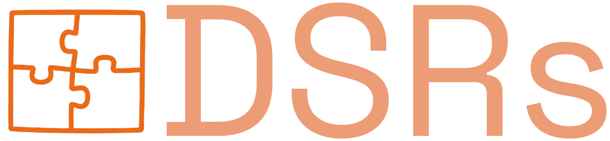

DSRs is a Rust library for building LM-powered applications. You declare each model interaction as a typed contract instead of writing prompts and parsers, compose interactions with ordinary Rust, and get a system where the whole pipeline is also data: printable, diffable, replayable, optimizable, and servable from a single text file.

- **Typed contracts.** Inputs, outputs, and instructions are a Rust struct. The library renders the prompt and parses the response into your types; malformed model output becomes a typed error, not a string-parsing bug.
- **Programs as data.** A `#[module]` function is read once at build time and projected into both a runnable function and a `.dsrs` artifact that cannot drift from the code. The artifact can be checked, diffed, served over HTTP, and embedded back into a build.
- **Recorded runs.** Every run is captured as a trace. Strict replay turns recordings into free, deterministic tests; until-divergence replay re-runs only the steps a change actually affects.
- **Optimizers.** COPRO, MIPROv2, GEPA, SIMBA, and BootstrapFewShot tune instructions and few-shot demos against your metric and dataset, without modifying your code.
- **Tools, agents, and Code Mode.** Models call typed Rust tools in bounded loops, or write one sandboxed JavaScript program that calls all tools in a single round trip. A capability system gates every access at load time.

## Start here

<CardGroup cols={2}>
<Card title="Quickstart" icon="rocket" href="/docs/getting-started/quickstart">
Install, configure a model, and make a typed call in five minutes
</Card>
<Card title="How DSRs thinks" icon="compass" href="/docs/getting-started/how-dsrs-thinks">
The mental model: contracts, programs as data, and the three authoring lanes
</Card>
<Card title="Signatures" icon="pen-ruler" href="/docs/components/signatures">
The first component: typed contracts for LM calls
</Card>
<Card title="Examples" icon="flask" href="/docs/guides/examples">
Every runnable example in the repository, indexed
</Card>
</CardGroup>

## Components

Each component has exactly one page covering what it is, how to use it, and its complete API surface.

| Area | Pages |
|---|---|
| Building blocks | [Signatures](/docs/components/signatures), [Predict](/docs/components/predict), [Modules](/docs/components/modules), [Adapters](/docs/components/adapters), [Language models](/docs/components/lm), [Data](/docs/components/data), [fx](/docs/components/fx) |
| Programs as data | [The module macro](/docs/components/module-macro), [Holes](/docs/components/holes), [Capabilities](/docs/components/capabilities), [Program & nodes](/docs/components/program-and-nodes), [The .dsrs format](/docs/components/dsrs-file), [Runtime](/docs/components/runtime), [CLI](/docs/components/cli), [State](/docs/components/state) |
| Tools & agents | [Tools & agents](/docs/components/tools-and-agents), [Code Mode](/docs/components/code-mode) |
| Evaluation & optimization | [Traces](/docs/components/traces), [Evaluation](/docs/components/evaluation), [Optimizers](/docs/components/optimizers), [COPRO](/docs/optimizers/copro), [MIPROv2](/docs/optimizers/miprov2), [GEPA](/docs/optimizers/gepa), [Optimizer engine](/docs/components/optimizer-engine) |
| Utilities | [Utilities](/docs/components/utils) |

DSRs is a from-scratch Rust rewrite of the ideas in [DSPy](https://github.com/stanfordnlp/dspy), designed around Rust's type system rather than ported from Python. Source and issues: [krypticmouse/DSRs](https://github.com/krypticmouse/DSRs).
